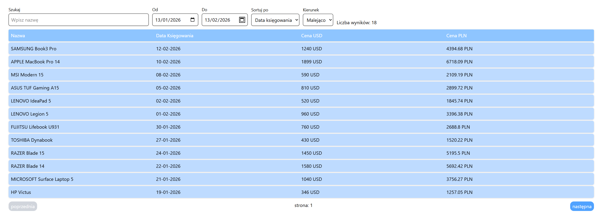

# Działanie aplikacji:

## Integracja z API NBP
Aplikacja pobiera kurs **USD/PLN** z API **NBP**.  
Za komunikację z zewnętrznym serwisem odpowiada klasa `NbpExchangeRateClient`.

W przypadku, gdy `bookingDate` przypada na dzień, dla którego API NBP nie udostępnia kursu (np. weekend lub inny dzień bez notowań), aplikacja nie odpytuje wyłącznie jednej konkretnej daty.  
Zamiast tego pobierany jest zakres obejmujący **7 dni wstecz**, a następnie wybierany jest najbliższy dostępny kurs dla danej daty księgowania. Dzięki temu aplikacja poprawnie obsługuje przypadki, w których kurs nie został opublikowany dokładnie w podanym dniu.

## Generowanie plików XML
Podczas tworzenia nowego produktu dane są zapisywane nie tylko w bazie danych, ale również eksportowane do pliku **XML**.

Wygenerowane pliki XML są zapisywane w katalogu:

`data/xmls`

## Dane testowe
Baza danych jest automatycznie populowana przykładowymi danymi testowymi za pomocą klasy `DevDataGenerator`.

Mechanizm ten działa w ramach profilu Spring **`dev`**, który w projekcie został ustawiony jako profil domyślny.  
Oznacza to, że po standardowym uruchomieniu aplikacji dane demonstracyjne są automatycznie dostępne.

## Funkcjonalności frontendu
Warstwa frontendowa aplikacji umożliwia:

- wyszukiwanie produktów po fragmencie nazwy,
- filtrowanie produktów po zakresie dat (`od` – `do`),
- sortowanie rosnące i malejące:
    - po nazwie,
    - po dacie księgowania.

# URUCHOMIENIE PROJEKTU

Projekt składa się z trzech części:
* **Docker / baza danych PostgreSQL** — katalog `/docker`
* **Backend (Spring Boot + Maven)** — katalog `/api`
* **Frontend (Angular)** — katalog `/web`

---

## WYMAGANIA

Aby uruchomić projekt potrzeba:
* **Docker** oraz **Docker Compose**
* **Java 21** (zalecana wersja: `21.0.10`)
* **Node.js v24.3.0** oraz **npm 11.5.1**

**Frontend korzysta z:**
* npm `11.5.1`
* Angular `21.2.x`

---

## 1. URUCHOMIENIE BAZY DANYCH

Przejdź do katalogu docker:
```bash
cd docker
````
Uruchom PostgreSQL - musi być działający docker daemon w tle:
```bash
docker compose up -d
```

---

## 2. URUCHOMIENIE BACKENDU

Przejdź do katalogu backendu:
```bash
cd api
```

> **Uwaga:** Backend wymaga Java 21, zalecana wersja to `21.0.10`.

Uruchom aplikację Spring Boot.

**Opcja A — jeśli projekt posiada Maven Wrapper:**
```bash
./mvnw spring-boot:run
```
*Na Windows:*
```powershell
.\mvnw.cmd spring-boot:run
```

**Opcja B — jeśli używasz globalnie zainstalowanego Mavena:**
```bash
mvn spring-boot:run
```

Backend powinien uruchomić się domyślnie pod adresem: `http://localhost:8080`

---

## 3. URUCHOMIENIE FRONTENDU

Przejdź do katalogu web:
```bash
cd web
```

Zainstaluj zależności:
```bash
npm install
```

Uruchom frontend:
```bash
npm start
```

Frontend powinien być dostępny domyślnie pod adresem: `http://localhost:4200`

---

***
# O Projekcie



Projekt jest aplikacją webową składającą się z:

- **bazy danych** - **PostgreSQL**
- **backendu** zbudowanego w oparciu o **Spring Boot + Maven**
- **frontendu** zbudowanego w oparciu o **Angular**

## Architektura backendu

Backend został zaprojektowany w stylu inspirowanym **architekturą heksagonalną (Ports and Adapters)**.

### Główne pakiety

#### `application`
Warstwa aplikacyjna zawiera logikę przypadków użycia.  
Znajdują się tutaj między innymi:

- `ProductCommandService`
- `ProductQueryService`
- porty wejściowe i wyjściowe
- modele aplikacyjne, np. `ProductsQuery`, `ProductsPage`

#### `domain.model`
Warstwa domenowa zawiera podstawowe modele biznesowe, np.:

- `Product`
- `NewProductData`

#### `adapters.in.web`
Warstwa wejściowa odpowiedzialna za komunikację HTTP.  
Zawiera:

- kontrolery REST
- DTO webowe
- walidację i obsługę błędów wejścia

#### `adapters.out`
Warstwa wyjściowa odpowiedzialna za integracje z infrastrukturą.  
Zawiera adaptery odpowiedzialne za:

- integrację z API NBP
- zapis i odczyt danych z bazy
- zapis produktów do XML

#### `dev`
Pakiet pomocniczy używany w środowisku developerskim.  
Zawiera klasę ładującą przykłądowe dane do aplikacji.

---

## Architektura frontendu

Frontend został zbudowany w oparciu o **prostą architekturę komponentową**.

Zastosowany został osobny folder `components`, w którym wydzielono komponenty odpowiedzialne za konkretne fragmenty interfejsu.

Przykładowe komponenty:

- `product` – komponent pojedynczego produktu
- `products` – komponent listy produktów
- `products-wrapper` – komponent nadrzędny spinający widok
